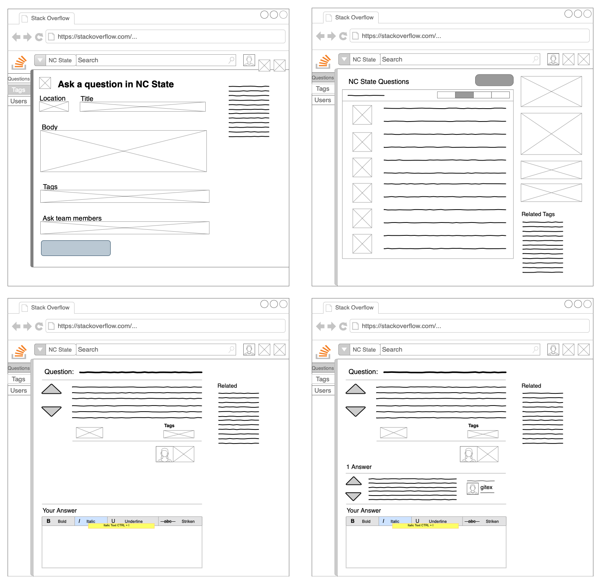
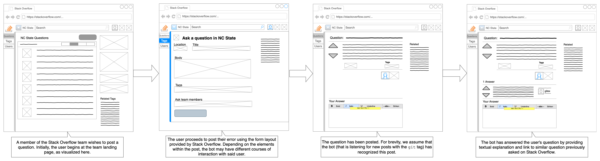
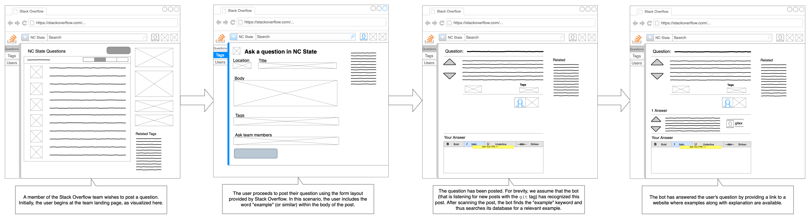
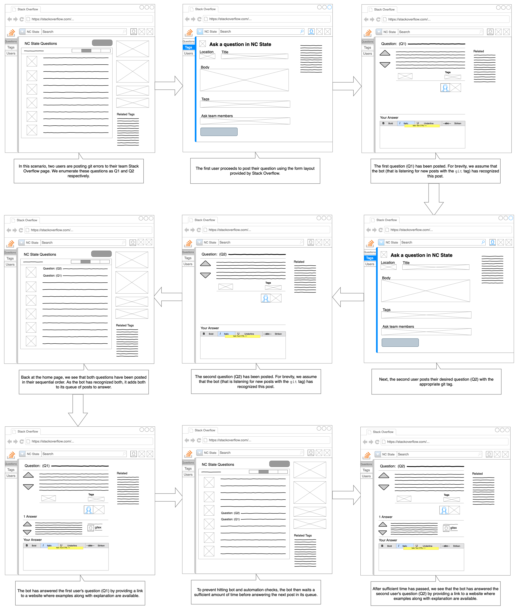

## Problem Statement
The Stack Overflow Team for NCSU is a medium where students or academic researchers post their queries or the problems/errors encountered by them during their academic endeavours. Many times these queries remain unanswered because either the questions were not properly formulated or there were too many questions (often repeated ones) being asked about a particular topic. Currently, almost a third of all asked questions are unanswered in the forum. Since students are often inexperienced users of Stack Overflow, they tend to ask questions which may have already been answered before. This creates a hassle for the instructors, TA's and other users to provide answers and links to those previously answered questions.

Additionally, Git has a steep learning curve. For students in a university, being accustomed to Git may seem daunting. There are many errors or issues encountered while using Git that have a much larger frequency of occurrence. Because of this, such queries are asked more often in Stack Overflow forums. Also, queries formulated by students may not be well articulated which may result in them not receiving solutions online and leading them to post their questions on Stack Overflow. Such questions when posted also often remain unanswered. Having their issues or errors resolved on the forum by providing them with already available solutions can result in more productive learning sessions for those students and thus reduce the load on the instructor or the TA's to answer such queries.

## Bot Description
The GIT Answer Bot on Stack Overflow will answer Git related questions asked by students, solutions of which have been previously answered on similar Stack Overflow questions. The Bot searches for answers in the dataset and chooses what it believes to be the best quality solution for a user's specific case, the information on which it attempts to glean from the body of the original post.
By considering a set of criteria (such as tags and key words used by the question's author, the upvotes on the accepted candidate solutions in the dataset, etc.), we anticipate that a higher solution quality may be achievable; though this is contingent on the criteria and their weighting.

The bot will also check for the presence of any requests within the question posted for examples of Git Commands to provide an answer containing a link for Atlassian's GIT command documents page.
It will seek to provide links that provide the most relevant examples for a user's given situation, and moreover those that contain descriptive text alongside.
For example, we consider a user who has just encountered a new git command that they perhaps don't quite understand the situation in which it would be most useful; or, perhaps what differentiates it from other similar commands.
By investigating meaningful examples, one can hope to glean proper context and use; this proves a motivating idea behind our consideration of providing examples.
As such, this positions our bot into the category of an Example Bot.

The essence of its functionalities can be expressed using the following tagline: *Git Answer Bot on NCSU Team on Stack Overflow*.

## Use Cases
```
Use Case: Give a possible answer to User's Query or Error that is related to GIT on NCSU Team Stack Overflow.
1 Preconditions -
    User must have the permission to post on NCState's Team Stack Overflow.
2 Main Flow -
    The User posts their query on NCSU's Stack Overflow.[S1]
    The bot listens to the questions related to Git posted by all users on Team Stack Overflow.[S2]
    The Bot generates an answer to the corresponding question.[S3]
    The solutions are posted by the bot on the user's question post.[S4]
3 Sub Flows -
    [S1] The User posts a question that contains errors or queries related to specific topics, with appropriate tags.
    [S2] The bot filters out all the questions posted on the Stack Overflow Teams that have used the 'Git' tag.
    [S3] The bot creates a solution containing an explanation and a link to previously answered related questions from the Stack Overflow Data Dump.
    [S4] This solution will be posted after a short indefinite time-period.
4 Alternative Flows -
    [E1] Unable to find solutions or 'Git' tag not present for the user's question, therefore the Bot does not post an answer.
```

```
Use Case: User's queries contain requests for examples for a particular Git command.
1 Preconditions -
    User must have the permission to post on NCState's Team Stack Overflow.
2 Main Flow -
    User is unsure of a command use, and thus posts a question with relevant tags requesting for examples.[S1]
    The bot listens for questions relating to GIT commands.[S2]
    The bot will then provide examples as a solution to the user based on the provided query in the question [S3].
3 Subflows -
    [S1] User will request for examples using text (like give examples, how to) in the question along with appropriate command tags.
    [S2] Bot filters out the questions that contain GIT and GIT_command tags.
    [S3] Bot builds a solution containing examples and a brief explanation of the requested command.
4 Alternative Flows -
    [E1] Question posted does not contain GIT or GIT command tags.
    [E2] Examples for the command are not available, hence the bot does not answer.
```

```
Use Case: New questions are posted when the bot is working on solutions to other questions.
1 Preconditions -
    Multiple questions waiting to be answered.
2 Main Flow -
    A new question has been posted before the bot has answered the previous question(s).[S1]
    If the new question is related to GIT, it would be added to the queue containing the set of unanswered questions.[S2]
    The bot will answer each question as per their queue position.[S3]
3 Subflows -
    [S1] Multiple new questions have been posted during the time the bot is working on an answer for another question.
    [S2] All the relevant GIT questions will be filtered out and added to the queue as per their time of posting.
    [S3] The bot will move through the queue and begin building solutions for the questions which are first in the queue and post them iteratively.
4 Alternative Flows -
    [E1] No new GIT related question was posted.
```

## Design Sketches
### Wireframe

[Link to wireframe diagram on Google Drive.](https://drive.google.com/open?id=1PpOAITC6kbzU4lQxC2Qr-N-pJn1thWFj)

#### Description
Above, we enumerate the states in which a user may find themselves when using the GIT Answer bot on Stack Overflow, derived directly from the preceding use cases.
As the bot in question resides on the NC State Stack Overflow team, each diagram is presented as such.
The bot is invoked whenever a new question is posted on the NC State Stack Overflow team. Further processing will be done if the question is associated with the `git` tag.

Diagram 1 presents the page that pops up after the user clicks the "Ask a question" button. Through this page users will input their query or error and, by tagging their post with the `git` tag, start a bot interaction. Our bot will use this information to check if the question is related to GIT. The user can also request for examples by including the keyword "example" in the body of the question.
After dictating and submitting their post, the user returns to the top right diagram; this represents the homepage for an individual Stack Overflow team; in particular, we show here the NC State Stack Overflow team page.

In the middle segment of the homepage diagram, we see the list of posts that are displayed according to a user's sorting preferences.
For the purpose of these diagrams and storyboards, we assume this to be sorted by "newest."
After submission, posts appear at the top of this segment and move down as newer posts are made.
The boxes directly to the left represent post details such as number of votes and number of answers, and at the top the user has options to control how posts are displayed.
By interacting with this feed, the bot has access to posts and their respective tags, allowing it to listen for new posts that are tagged with the `git` tag.

The bottom left wireframe shows the view of a single post, with the post text directly right of the up-vote and down-vote arrows.
From this text, the bot may scan to detect if the keyword *example* is given; if so, the bot will respond appropriately by providing example links.
Below this are the tags associated with a post, which as mentioned prior must contain the `git` tag to engage our bot.
At the bottom of this diagram is a reply box, where a user may provide a potential answer for the post in question.
The diagram at the bottom right presents the view after the bot answers the question. The bot will first check if the question has a git tag. If yes, the bot will do further processing according to the type of request. The answer will be posted in a pre-determined format that includes a link to a similar question if available.
In our wireframe, we show a reply from user "gitex", which is used to represent a reply posted by our bot.


### Storyboards

To ensure clarity, we separate our storyboards into three separate sections representing the scenarios in which a user may find themselves when interacting with our bot.

#### Storyboard 1: Automated `git` Answers

[Link to above diagram on Google Drive](https://drive.google.com/open?id=1V924lBIFctHRL75U4cPvXn2FVr2BlBHb)

In what is perhaps the primary use case of our bot, we see above a scenario in which our bot provides a possible answer to a user's query or error.
The user begins by composing a post of some `git`-related query or error, which they post to their team's Stack Overflow page.
Our bot, which actively listens to the post feed for new `git` posts, then attempts to provide an answer related to that which was provided in their original post.
If no satisfactory solution can be provided, the bot will instead choose to not post an answer; for example, a question that is too specific to have much extant external knowledge or one which does not provide much detail at all for the bot to parse.

#### Storyboard 2: Example Sourcing

[Link to above diagram on Google Drive](https://drive.google.com/open?id=1w2fTfZGslcQJENDu8xF05zQsllkdLDOF)

If, included within a `git`-tagged post made by a user, there exists the word **example** (or similar), the bot will behave in the fashion presented in the diagram above.
Here, the bot is expected to return a link to a related example that preferably has an accompanying textual explanation.
The story progresses in the same way as before; a user posts a `git`-tagged question to Stack Overflow where it is within scope of our bot.
In this post, the user includes one of the aforementioned key words; for example, a user may have encountered a new `git` command that they can't quite understand and want to see used with context.
The answer constructed by our bot will therefore include a link to an example of the command in use, preferring to provide links in which a more context is provided.

#### Storyboard 3: Question Multiplicity

[Link to above diagram on Google Drive](https://drive.google.com/open?id=11ZzU68iYbN4MKfAkHiwJ-leSn9pTYtD1)

In the above scenario, we encounter two users who are in the process of posting two separate `git`-related questions to their Stack Overflow team.
To avoid encountering bot-prevention techniques employed by Stack Overflow (such as CAPTCHA codes or account bans), our bot enqueues posts that meet its criteria into an internal queue.
After answering a post, the bot will ensure that an adequate amount of time has passed before it posts an answer to the other.
During this intermediary time, the bot is free to engage in answer-generation for other posts; if so, these generated answers will be returned in the order enqueued in the exact same fashion.

## Architecture Design

<center></img></center>


### Design Description
Architecture Diagram:
The above diagram represents the architecture for our GIT Answer Bot on Stack Overflow. The working of each of its components is as follows:

1. _NC State Stack Overflow Website_ - This is the interface through which the bot provides information to the user. The users post questions on NCSU's Stack Overflow by providing a heading, describing their issues/queries and adding associated tags to their queries. These questions can be a textual query, may contain code error snippets or even a request for examples of GIT commands. Based on the query message, the bot generates a solution message(if a good solution already exists) using the server-side logic and the available datasets and posts the answer once it is ready.

2. _StackExchange API_ - This is used for fetching the recently asked questions and posting solutions to Stack Overflow. The data returned by the API is first filtered by tags and then put into an incoming questions queue. Its also used while posting the generated answers sequentially from the outgoing answers queue to Stack Overflow.

3. _Incoming and Outgoing Data Queues_ - These queues are used to store the questions and answers sequentially. The questions on Stack Overflow are first filtered and checked whether they contain appropriate GIT and Git Command related tags. If yes, the bot stores the details of the question in the Incoming Questions queue. The queue is used to make sure that even when multiple questions are being posted, it keeps track of the sequence of the questions while it is busy generating solutions for previously asked questions. The outgoing answer queue is used to store the answers generated by the bot. The answers are sequentially posted with some finite time intervals to make sure that answers are not posted instantaneously and Stack Overflow does not mark the Bot Account's behaviour as inappropriate.

4. _Server Logic_ - The server logic is the component that carries out the entire processing and answer generation for asked question. For each question in the input queue, it forms a feature vector containing all the important words which have significance related to the question. This is then compared with the existing Stack Overflow dataset which contains information about and relating to all the questions and answers that have been already posted. It then looks for the set of the most relevant questions available in the dataset and selects the best answers out of it based on factors like the number of upvotes, accepted answers etc. The bot then formulates a reply to the question which contains some text from the selected answer along with its link. Once the answer has been formulated, it is added to the outgoing answer queue. Our Bot shall be hosted on a Cloud Platform like Heroku.

### Constraints
+ The bot can provide answers to questions only relating to Git.
+ The bot can generate output only from the database/files.
+ The bot will not be able to provide answers for questions that haven't been asked or answered before.
+ The bot does not answer questions instantaneously but after some finite time.

### Additional design patterns considered

Initially we considered the following architecture designs:
#### Pipes and Filters
<center></img></center>

_Pipes and Filters_: This architecture allows the designer to understand the overall input/output flow for various components of the system. The filters process the data from the inbound pipes and publish the processed data to the outbound pipes. In our system, the user posts the question on the NCState Stack Overflow website which the bot requests periodically. It then filters the questions for relevant ones based on tags and adds them to a question queue. According to the type of request, there are two sub-flows, a primary one and a secondary one. The user can ask for help with regards to an error, a theoretical doubt or even a question related to a specific topic. The bot will parse the question into a feature vector and lookup for similar questions and solutions in the Stack Overflow dataset. If found, it will then generate a formatted answer for the query. This is the primary workflow. Our secondary workflow would occur if the user requests for examples of the git commands and its usage. The bot then provides links to Atlassian's website for particular commands and features. A formatted answer is generated from all the processed data. The bot will then post the answer on the NCState's Stack Overflow.

This type of architecture is generally used to divide the entire task into smaller sequential processing tasks. Our bot does not deal with plenty of sequential processes, and instead, has multiple use-cases that have different workflows and parallel processing. Although the pipes and filters pattern seemed relevant initially, it was not selected as our Bot's Architecture.

#### Layered Architecture
<center></img></center>

_Layered Architecture_: In this architecture, the components of the bot are broken down into the following layers:

Stack Overflow for NCSU: This is the place where the bot interacts with the user. The bot listens for any new questions that have been posted on this forum and then after processing and checking for solutions if any, it answers the user's questions.

Application Logic Layer: This layer interacts with Stack Overflow using the StackExchange API. It listens for any new questions posted about Git on NCSU's StackExchange. It reads those questions and checks if there are good relevant existing answers in the dataset already. It also checks if the user has asked for examples regarding a certain command. It generates an answer based on various factors like source answer's upvotes, accepted answers, etc. It then posts the answer back to Stack Overflow.

Data Interface Layer: This layer is responsible for directly interacting with the database. It fetches data regarding specific questions, along with command example links if required, and passes the data along to the Application Logic Layer for answer formulation.
