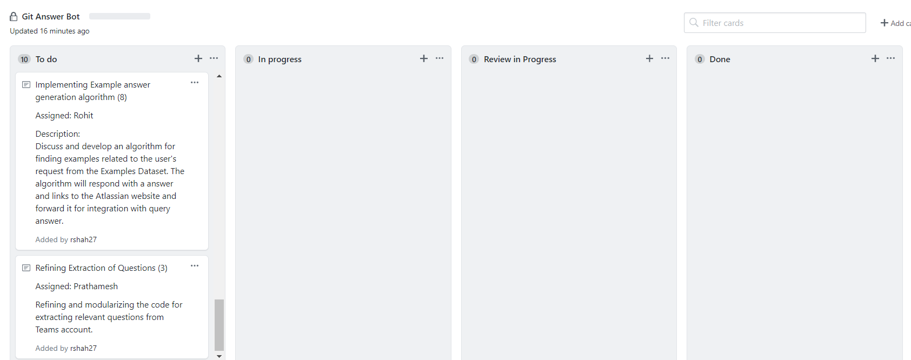
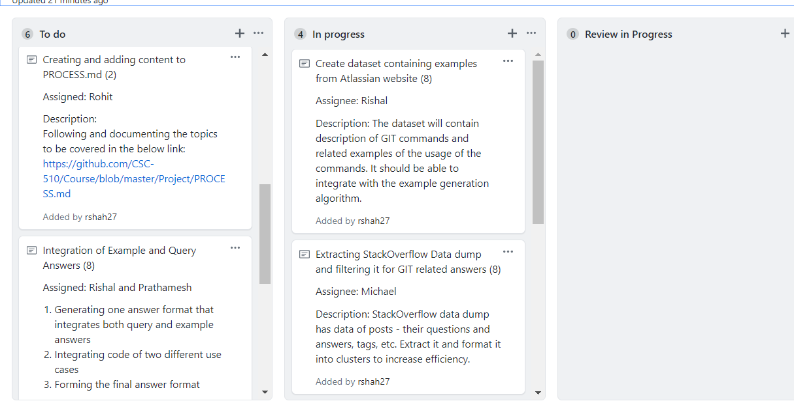
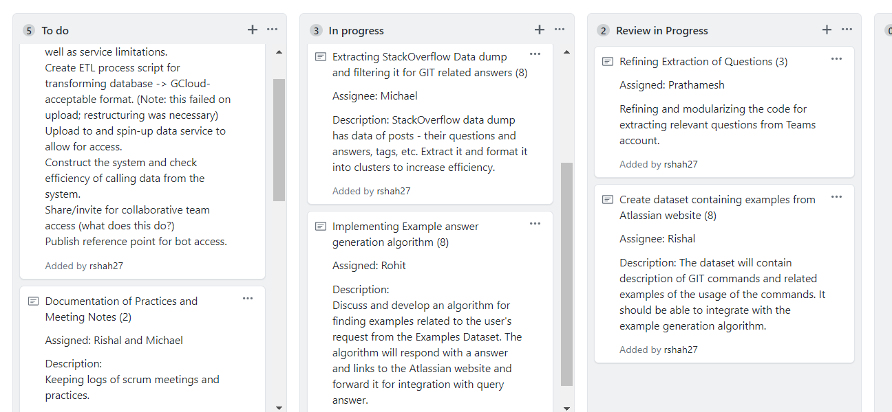
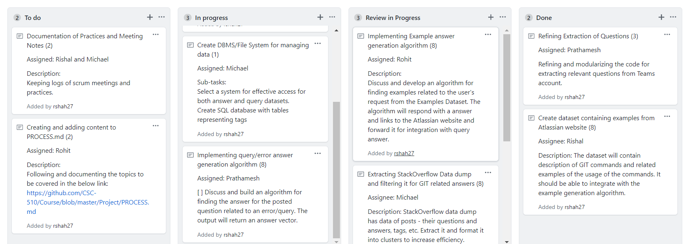
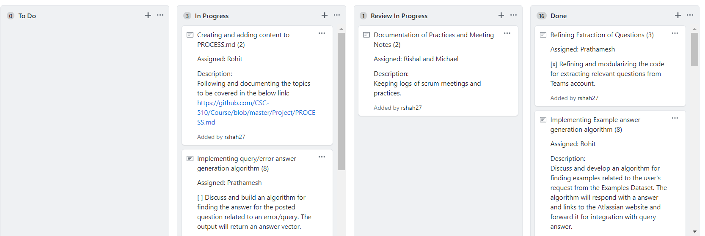
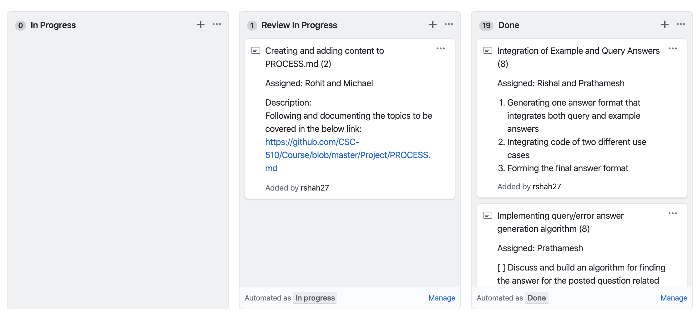
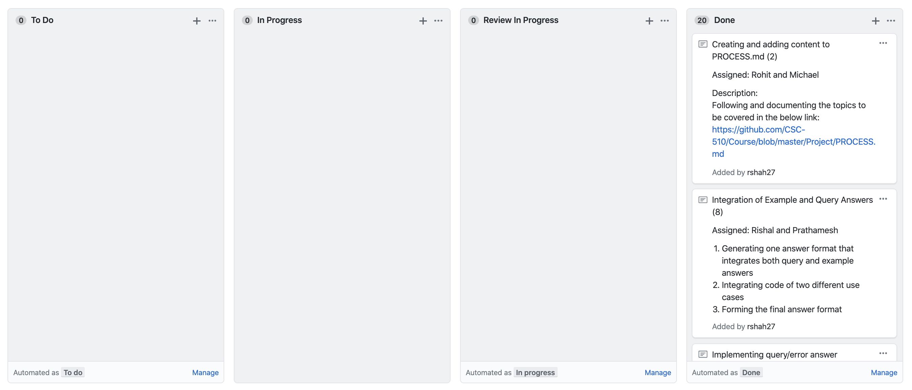

# PROCESS

## Storyboard Documentation

In our first meeting, we added the basic tasks and assigned tentative story points to those tasks. We also assigned these tasks to the team members:
  

Next, we finalized and formed all our tasks and concretely added assignees and storypoints to it. Few of the tasks were then moved to the In Progress phase.
  

After a few days, some of the tasks had their build completed and then moved to Review in Progress phase as these tasks had pending validation and integration with other tasks.
  

At the end of the first iteration, few of tasks were fully completed whereas some tasks were in Review in Progress phase as they were dependent on some other tasks to be completed.

For the second iteration, all our ToDo tasks were picked up by the respective assignees and hence there were no ToDo tasks pending. This iteration was mostly related to intergration of different project components and completion of documents for the milestone.

Here, all tasks have been processed completely and the documentation story is in review phase.

At the end of the second iteration, all the tasks were successfully completed and added to the Done phase.

## Scrum Meeting Notes

[Meeting Notes](./meetings.pdf)  

The above document includes all our meeting agendas, notes and action items along with the core and corollary practices which we followed while developing our bot.

## Iteration Documentation
### First Iteration
In the first iteration, we had the following tasks in hand:
+ Creating and setting up Kanban board, adding User Stories, deciding the Story points and assigning them to team members
+ Extracting StackOverflow Data dump and filtering it for GIT related answers
+ Create dataset containing examples from Atlassian website
+ Refining Extraction of Questions
+ Implementing Example answer generation algorithm
+ Implementing Query/Error answer generation algorithm
+ Create DBMS/File System for managing data

After the end of first iteration, we completed the tasks of Creating storyboard and User Stories, extracting and creating both datasets, refining the extraction of Questions code and implementing example answer generation algorithm on the example dataset.
The tasks of Implementing Query/Error answer generation algorithm and creating DBMS/File System for managing data took us more time than expected as we had to split the huge StackOverflow datadump into separate tables by their GIT tag. So we decided to move these two tasks into the next iteration.

### Second Iteration
In the second iteration, we had the following tasks in hand:
+ Implementing Query/Error answer generation algorithm (Moved from first iteration)
+ Create DBMS/File System for managing data (Moved from first iteration)
+ Create Interface Layer for Remote Database Access
+ Migrate Data Storage to Google BigQuery/SQL Storage
+ Documentation of Practices and Meeting Notes
+ Integration of Example and Query Answers

At the end of the iteration we were able to successfully able to determine the nature of the input question from the user and fetch the appropriate answer from the datasets. Thus we completed all the tasks for the Process phase and have built a Bot which is able to satisfy all our Usecases.
