# Milestone: REPORT

## PRESENTATION

[Link](https://drive.google.com/file/u/1/d/1VaOyAepHgTm7tEi2K2LzrH8egP_AIj0d/view?usp=sharing) to the presentation.

## REPORT

#### The Problem our bot solved

There is a considerable number of unanswered questions currently on the NC State's Stack Overflow Team account. These questions many-a-times remain unanswered probably because either the questions were poorly formatted or there were too many questions (often repeated ones) being asked about a particular topic. Its then up to the instructors, TAs and other enthusiastic users to provide answers and links to all such questions, which at times is not possible.
If there was a way to automatically answer new questions that have a similar previously asked question in the main stack overflow website with a link to that question would significantly reduce the efforts of Instructors and TA's in answering such questions and would also prevent questions from never being answered, which otherwise could be helpful to someone else later on.

Our bot aims to solve the problem of providing solutions / examples to user's Git related questions / git command example queries posted on NC State's Stack Overflow Team account by posting appropriate links and answers to newly asked Git related questions provided a similar question had already been answered on the public stack overflow platform.

#### Primary Features and Screenshots
The Git Answer Bot aims to provide the best possible answer to git related queries and requests for examples on the NC State's Team account. It has the following set of features:
 - It resides on the NC State's Stack Overflow Teams website.
 - It reads only the unanswered questions from the website and picks only the recent ones that have 'Git' tag associated with it.
 - It then identifies the type of question - 1. A Git related query or 2. Request for examples of a Git command.
 - If it is a Git related query, then it gives the closest answer to the asked question by looking into Stack Overflow Public dataset that has millions of Git related questions already answered.
 - The answers are picked only from the public stack overflow questions that have their answers marked as accepted, after which the bot proceeds to answering the question.

 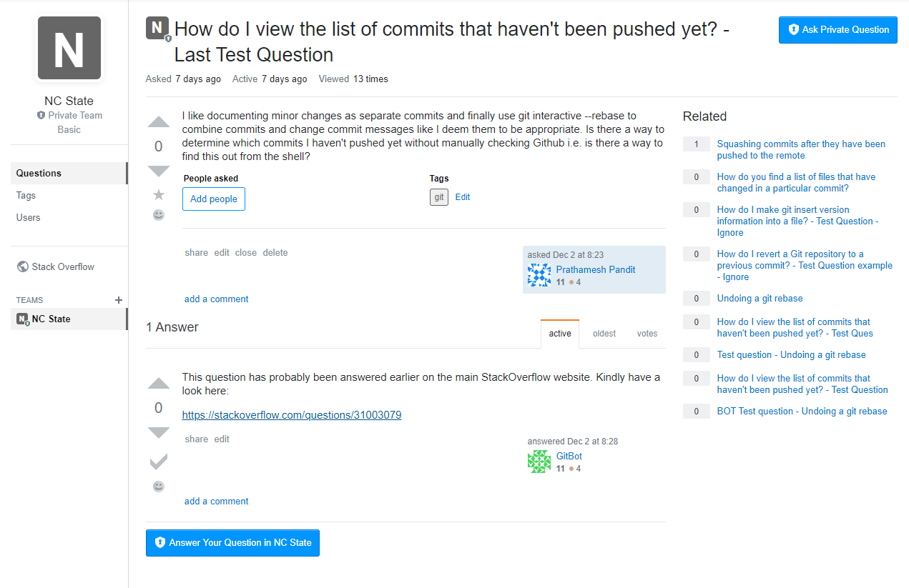

 - For questions that are request for examples of Git commands, our Bot provides documentation and multiple examples. It also provides a link to the reference of the source.

 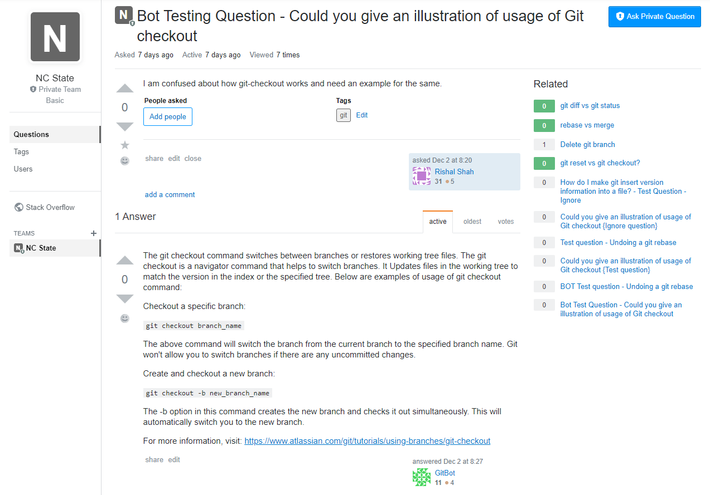

 - If a question is posted when the bot is working on answering previous questions, then after it is done answering the previous questions, the new question is picked for answering. If it does not find a reasonably similar question on the public stack overflow site, the bot does not post a response.
 - The typing speed to type the answers by the Bot has been adjusted to human-like speed so as to avoid the Bot being recognized as a Bot by the StackExchange forum.
 - The Bot is always listening the NC State Stack Overflow website for new Git related questions.
 - After answering all the questions from its queue, the Bot goes into a definite sleep time, so as to wait for new questions and also to avoid frequent relogging into the account which might expose its identity as a Bot to the StackExchange API.

 Here is how everything looks like. New questions are posted on the NC State's Stack Overflow forums. The first is a request for example of a Git command (git-checkout) whereas the second question is a git related query.

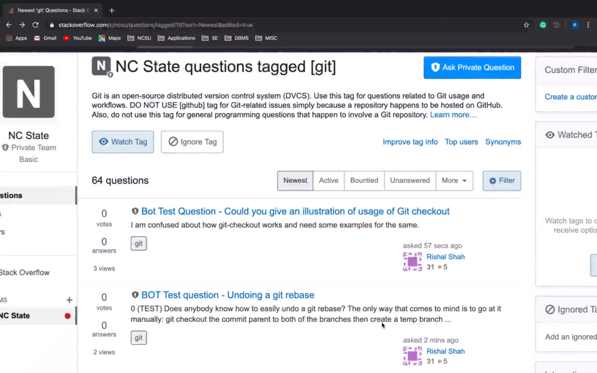

Our bot logs into the forum using Pyppeteer, and then extracts all unanswered git tagged questions.

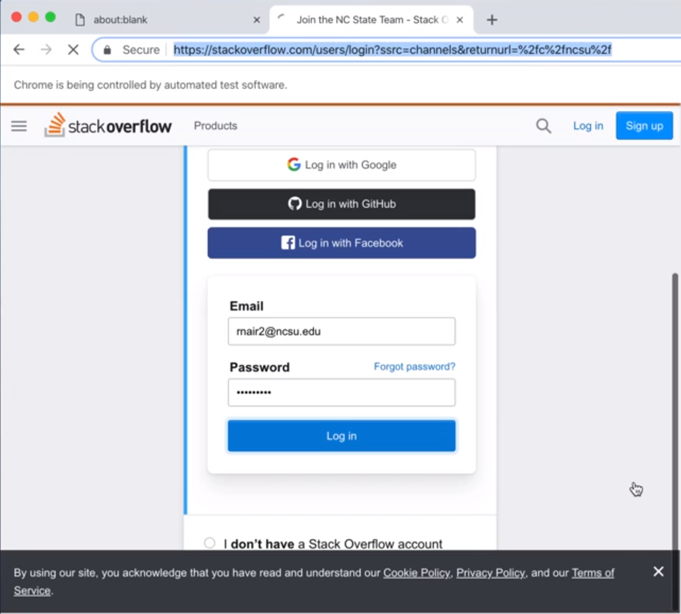

It then picks the oldest git related unanswered post (within a fairly recent timeframe). If the post is a query, it starts searching for similar answered posts from the StackExchange dataset. Once it finds it, it starts typing the formatted text which points to the solution.

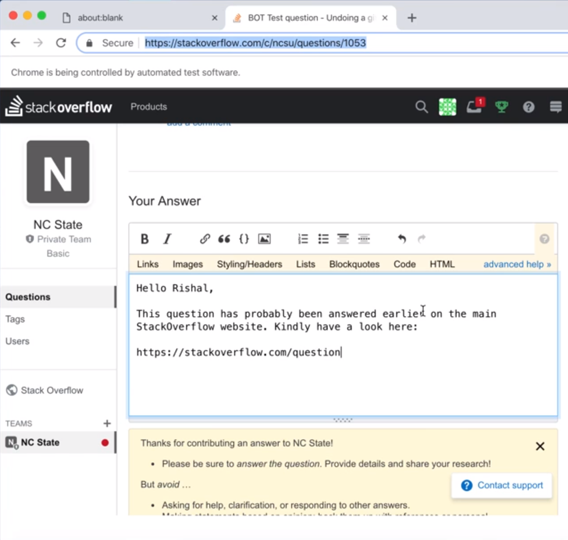

If the question is a request for an example of Git commands, then it searches the [git_examples.json](../git_examples.json) dataset for documentation and examples of the relevant command. It then types in the fetched answer and posts it on that question.

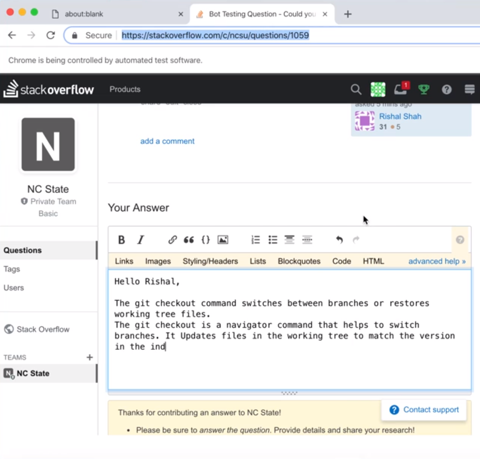

While working on answering the current questions, if a new question is posted on the NC State Overflow website, it will then first finish answering its existing queue of questions and then close the window. After a certain time period, it will re-login and extract all the unanswered questions again and then proceed towards answering them if necessary.

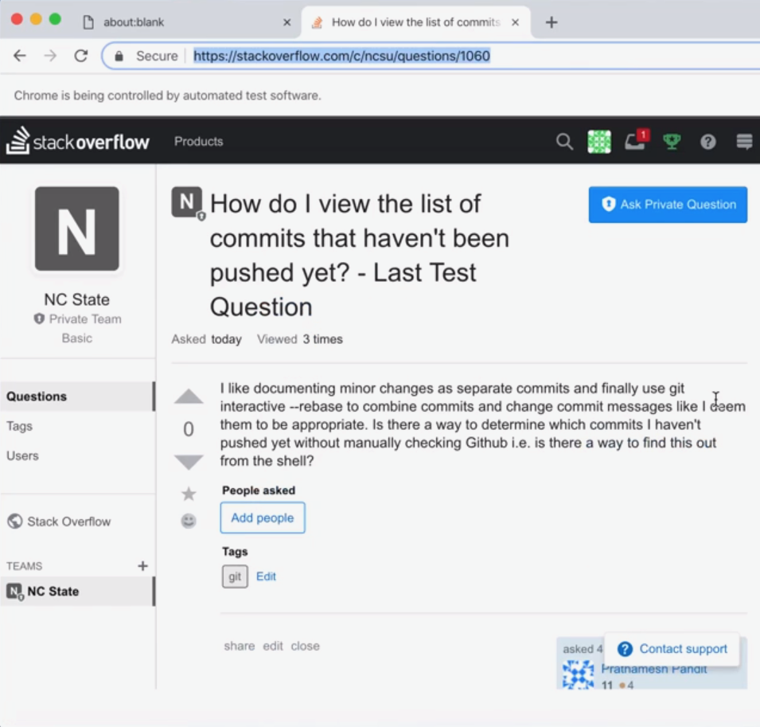

Below the answers the newly asked question in its next iteration.

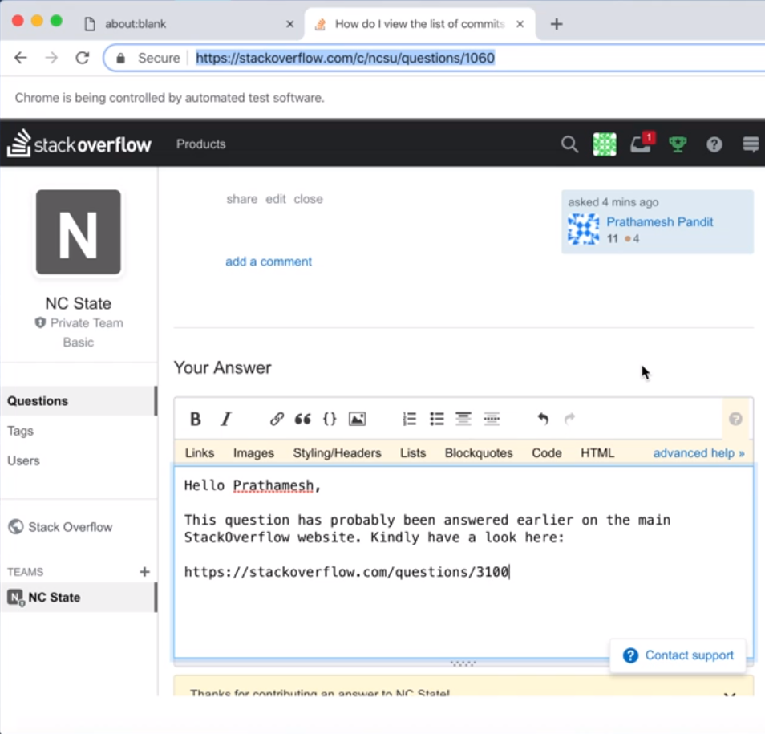

The bot is hosted on Google Cloud Platform where a Compute engine VM is created to run the Bot.

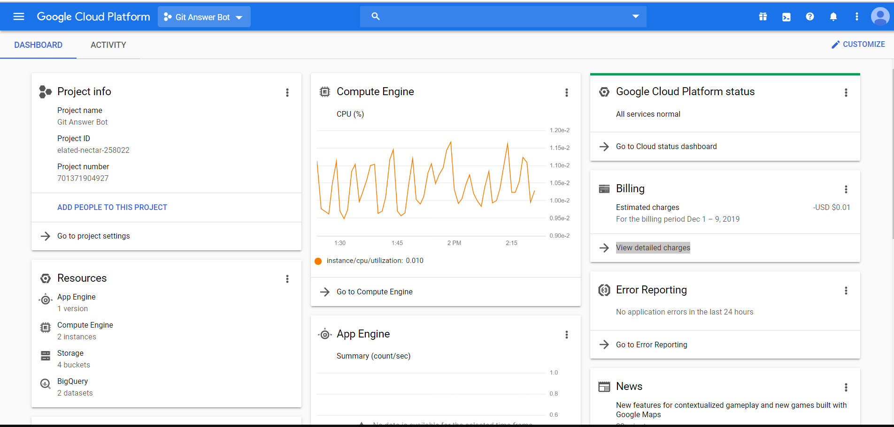

The below image shows the BigQuery dataset created to store the huge publicly available StackExchange dataset for Stack Overflow questions and answers. The dataset is divided into multiple tables each containing questions and answers and other information associated with each of the popular git tags on Stack Overflow's website.

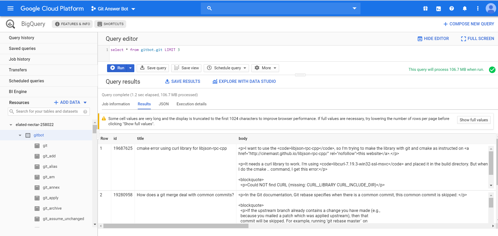

The below image shows a snippet of the [git_examples.json](../git_examples.json) dataset that contains documentation and examples of few Git commands taken from the Atlassian website that the bot uses to answer request of example questions.

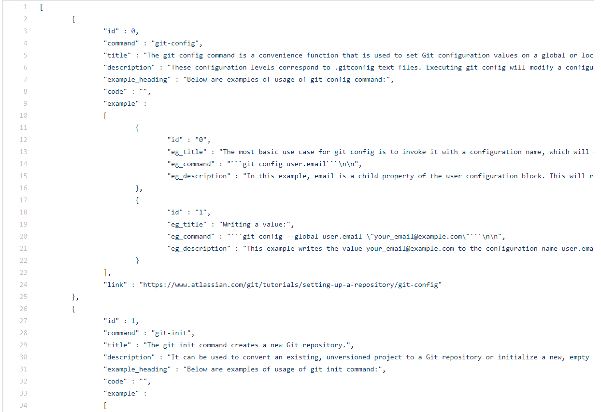

#### Reflections on the development process and project

As part of the Software Engineering course, we were required to build a bot to address any software engineering issue. The bot category we selected was an Example Bot. We wanted to work on creating a Bot that provides answers to stack overflow questions. After the initial brainstorming sessions and discussions with professor we decided to build a bot that answers queries or example requests on university's stack overflow team that prevents git related questions from remaining unanswered if an answer already existed in the public forums. While working on the project, we found that applying software engineering principles like Design patterns, Agile Methodologies, using Github Projects for project management was very helpful in bringing structure to our implementation. Our design was well thought-of yet flexible enough to accommodate changes. Testing was easy once the mocking was completed. Deployment was hassle free once the CI/CD tools/techniques were set up. Overall, the topics covered throughout the course helped us efficiently deliver a good product in a timely fashion and working on this project provided us with a great learning experience.

#### Limitations and future work

The scope of the Git Answer Bot was limited to answering GIT related questions on the NC State's SO Team account. For future scope, we could expand the scope of the bot to find answers to many other questions asked on the forum like programming concepts, coding doubts, or even homework related doubts. The model for the bot to fetch questions, preprocess them, find answers and successfully post it on the Teams account has been built. To implement new tasks, one can just add new datasets and following a few tweaks make the bot to perform a long list of tasks.
The bot currently uses word vectorization along with cosine similarity to find highly similar answered questions to build its solution. By implementing text mining or other natural language processing algorithms the bot might be able to find related questions more efficiently and quickly than the current implementation.
